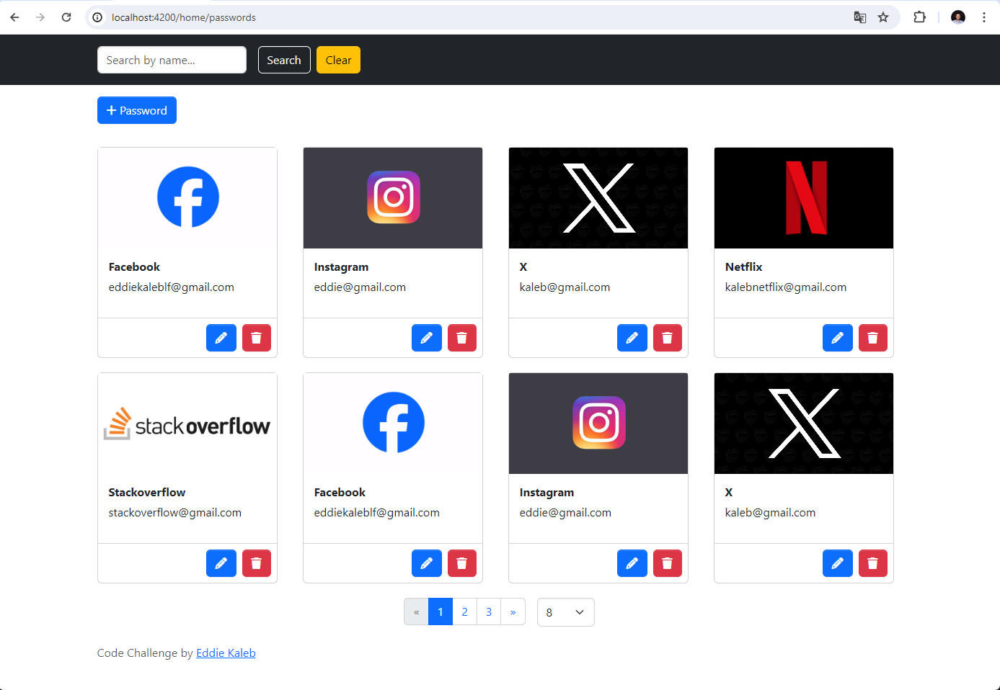
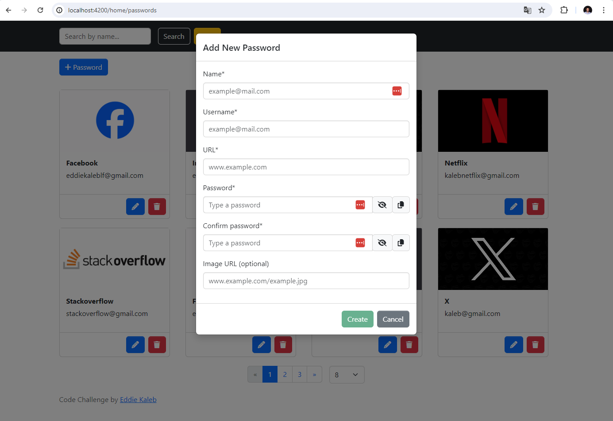
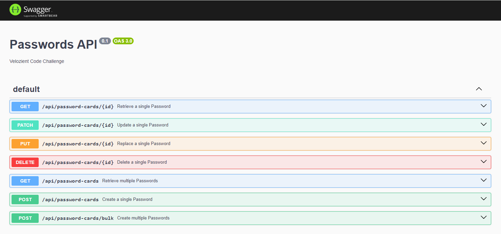
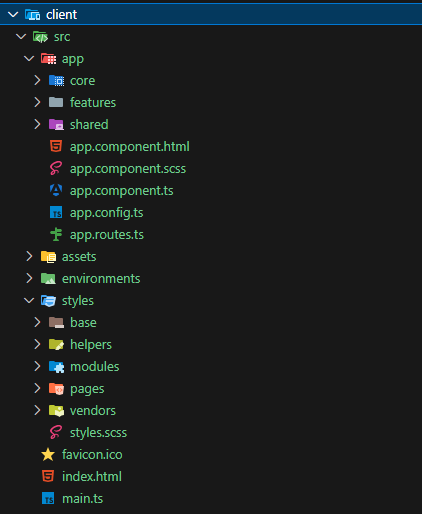
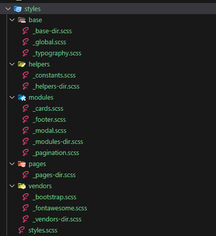
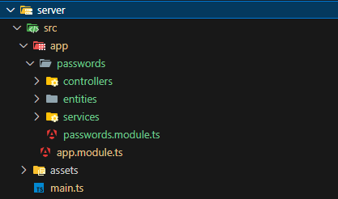
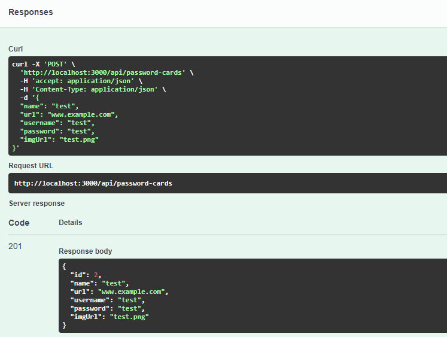

# Velozient Code Challenge

## Description

This project was built with Angular 17, NestJS (NodeJS framework) and memory database (sqlite3).

## Start the application

Run `npm install` at root folder

Run `nx run-many --target=serve --projects=server,client` to start the development server (**port 3000**) and client (**port 4200**).

## API documentation

After run the application access the [API Swagger docs](http://localhost:3000).

## Details of the project

The project is structured as a monorepo to get better management and maintenance.

### Frontend

The frontend side has the below folder structure:

One of the good practices of this project is keep a folder strucure for the CSS styles:

Another good practices found are:

- Modularization
- Lazy loading modules
- SOLID principles

I chose to use bootstrap as the UI library.

### Backend

The backend side has the below folder structure:

I chose to use sqlite as the memory database and the swagger for API docs that is also working as test server as shown below :D

Another important addition for this project was the library [@dataui/crud](https://github.com/gid-oss/dataui-nestjs-crud) that allows create CRUDs faster.
